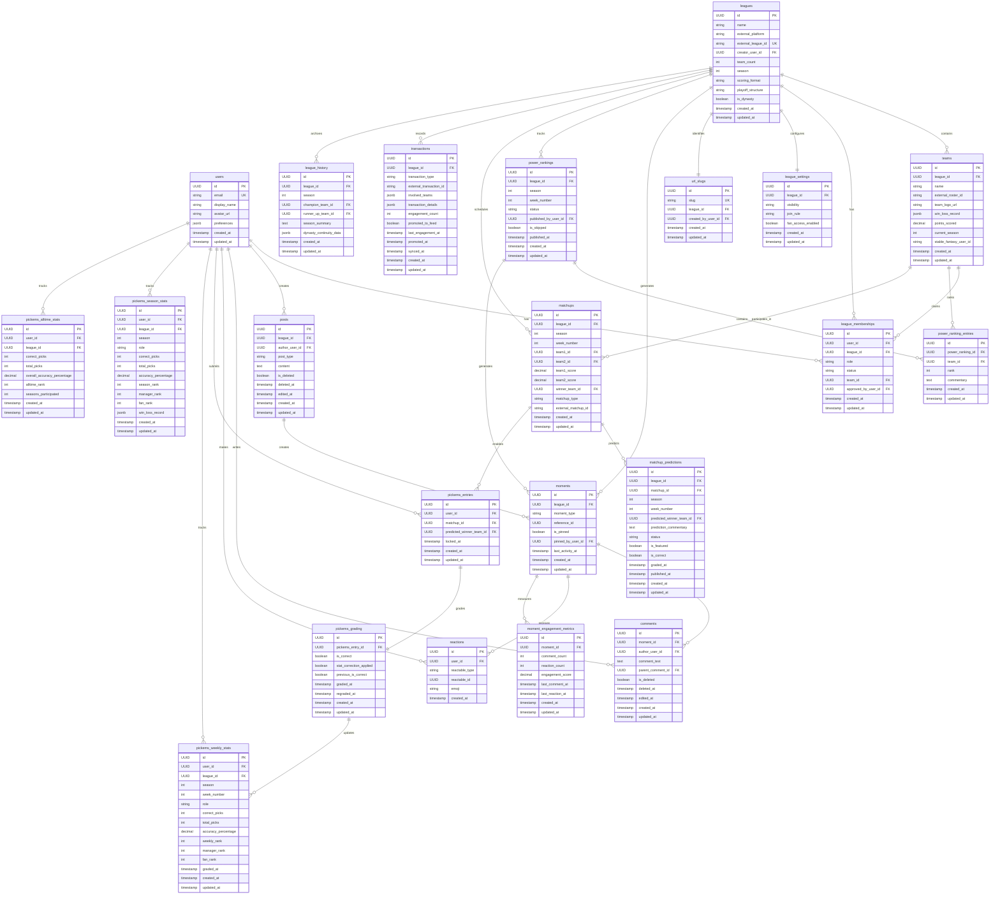

# Data Schema Specification

## Overview

This document defines the complete database schema for FSHQ.gg, a Fantasy Sports Clubhouse platform. The schema is implemented using PostgreSQL via Supabase and supports:

- Multi-role user participation (Admins, Managers, Fans)
- External fantasy league integration (initially Sleeper)
- Commissioner content creation (power rankings, matchup predictions)
- Social engagement (feed, comments, reactions)
- Pick'ems competition with role-based leaderboards
- Transaction history and league archives
- Dynasty league continuity across seasons

The schema emphasizes data integrity through foreign key relationships, efficient querying via strategic indexes, and security through Row-Level Security (RLS) policies.

## Entity Relationship Diagram

## Entities

### users

Stores user account information and authentication details via Supabase Auth.

| Field | Type | Constraints | Description |
|-------|------|-------------|-------------|
| id | UUID | PK | Primary identifier |
| email | String | UNIQUE, NOT NULL | User email for authentication |
| display_name | String | NULL | Optional display name |
| avatar_url | String | NULL | URL to user avatar image |
| preferences | JSONB | NULL | User preferences and settings |
| created_at | Timestamp | NOT NULL, DEFAULT NOW() | Account creation timestamp |
| updated_at | Timestamp | NOT NULL, DEFAULT NOW() | Last update timestamp |

**Relationships:**
- Has many league_memberships (1:N)
- Has many posts (1:N)
- Has many comments (1:N)
- Has many reactions (1:N)
- Has many pickems_entries (1:N)
- Has many pickems_weekly_stats (1:N)
- Has many pickems_season_stats (1:N)
- Has many pickems_alltime_stats (1:N)

**Business Rules:**
- Email must be unique across system
- Integrates with Supabase Auth for authentication and session management
- User deletion cascades to all user-created content and relationships

**Indexes:**
- Index on email for efficient login lookups

---

### leagues

Stores league configuration and metadata with external platform references.

| Field | Type | Constraints | Description |
|-------|------|-------------|-------------|
| id | UUID | PK | Primary identifier |
| name | String | NOT NULL | League display name |
| external_platform | Enum | NOT NULL | External platform (e.g., 'sleeper') |
| external_league_id | String | NOT NULL | External platform league identifier |
| creator_user_id | UUID | FK → users.id, NOT NULL | League creator (initial admin) |
| team_count | Integer | NULL | Number of teams in league |
| season | Integer | NULL | Current season year |
| scoring_format | String | NULL | League scoring format |
| playoff_structure | String | NULL | Playoff configuration |
| is_dynasty | Boolean | DEFAULT FALSE | Dynasty league flag |
| created_at | Timestamp | NOT NULL, DEFAULT NOW() | League creation timestamp |
| updated_at | Timestamp | NOT NULL, DEFAULT NOW() | Last update timestamp |

**Relationships:**
- Has many teams (1:N)
- Has many league_memberships (1:N)
- Has one league_settings (1:1)
- Has one url_slugs (1:1)
- Has many moments (1:N)
- Has many power_rankings (1:N)
- Has many matchups (1:N)
- Has many transactions (1:N)
- Has many league_history (1:N)
- Belongs to one user (creator) (N:1)

**Business Rules:**
- Combination of (external_platform, external_league_id) must be unique
- League deletion cascades to all dependent entities
- Is_dynasty flag controls season continuity handling

**Indexes:**
- Unique index on (external_platform, external_league_id)
- Index on external_league_id for fast league detection
- Index on creator_user_id

---

### teams

Stores team information within leagues with external roster mapping.

| Field | Type | Constraints | Description |
|-------|------|-------------|-------------|
| id | UUID | PK | Primary identifier |
| league_id | UUID | FK → leagues.id, NOT NULL | Parent league |
| name | String | NOT NULL | Team name |
| external_roster_id | String | NULL | External platform roster identifier |
| team_logo_url | String | NULL | URL to team logo image |
| win_loss_record | JSONB | NULL | Current win-loss record |
| points_scored | Decimal | NULL | Total points scored |
| current_season | Integer | NULL | Current season year |
| stable_fantasy_user_id | String | NULL | Stable ID for dynasty continuity |
| created_at | Timestamp | NOT NULL, DEFAULT NOW() | Team creation timestamp |
| updated_at | Timestamp | NOT NULL, DEFAULT NOW() | Last update timestamp |

**Relationships:**
- Belongs to one league (N:1)
- Has many league_memberships (1:N)
- Has many power_ranking_entries (1:N)
- Participates in many matchups (N:N)

**Business Rules:**
- Combination of (league_id, external_roster_id) must be unique
- Stable_fantasy_user_id anchors team continuity across seasons in dynasty leagues
- Team deletion cascades to ranking entries but sets NULL in memberships

**Indexes:**
- Composite unique index on (league_id, external_roster_id)
- Index on league_id for efficient team listing

---

### league_memberships

Tracks user participation and roles in leagues with approval workflows.

| Field | Type | Constraints | Description |
|-------|------|-------------|-------------|
| id | UUID | PK | Primary identifier |
| user_id | UUID | FK → users.id, NOT NULL | Member user |
| league_id | UUID | FK → leagues.id, NOT NULL | Target league |
| role | Enum | NOT NULL | User role: 'admin', 'manager', 'fan' |
| status | Enum | NOT NULL | Membership status: 'pending', 'approved', 'rejected' |
| team_id | UUID | FK → teams.id, NULL | Claimed team (for managers) or supported team (for fans) |
| approved_by_user_id | UUID | FK → users.id, NULL | Admin who approved membership |
| created_at | Timestamp | NOT NULL, DEFAULT NOW() | Membership creation timestamp |
| updated_at | Timestamp | NOT NULL, DEFAULT NOW() | Last update timestamp |

**Relationships:**
- Belongs to one user (N:1)
- Belongs to one league (N:1)
- Optionally belongs to one team (N:1)
- Approved by one user (admin) (N:1)

**Business Rules:**
- Combination of (user_id, league_id) must be unique (one membership per user per league)
- Admin role grants full configuration and moderation permissions
- Manager role grants team claiming and commissioner desk access (if designated)
- Fan role grants read access, engagement features, and optional team support
- Status 'pending' requires admin approval based on league join_rule setting
- Multiple users can claim the same team (co-managers supported)

**Indexes:**
- Composite unique index on (user_id, league_id)
- Composite index on (user_id, league_id) for multi-league switcher
- Composite index on (league_id, status) for approval queue queries

---

### league_settings

Stores per-league configuration options for visibility and access control.

| Field | Type | Constraints | Description |
|-------|------|-------------|-------------|
| id | UUID | PK | Primary identifier |
| league_id | UUID | FK → leagues.id, UNIQUE, NOT NULL | Parent league |
| visibility | Enum | NOT NULL, DEFAULT 'private' | League visibility: 'public', 'private' |
| join_rule | Enum | NOT NULL, DEFAULT 'approval_required' | Join workflow: 'auto_join', 'approval_required' |
| fan_access_enabled | Boolean | NOT NULL, DEFAULT TRUE | Allow fan role in league |
| created_at | Timestamp | NOT NULL, DEFAULT NOW() | Settings creation timestamp |
| updated_at | Timestamp | NOT NULL, DEFAULT NOW() | Last update timestamp |

**Relationships:**
- Belongs to one league (1:1)

**Business Rules:**
- Each league has exactly one settings record
- Visibility 'public' enables league discovery
- Join_rule controls automatic vs. manual membership approval
- Fan_access_enabled toggles availability of fan role
- Settings deletion cascades with league deletion

**Indexes:**
- Unique index on league_id

---

### url_slugs

Stores unique league URL identifiers for routing with collision handling.

| Field | Type | Constraints | Description |
|-------|------|-------------|-------------|
| id | UUID | PK | Primary identifier |
| slug | String | UNIQUE, NOT NULL | URL-safe league identifier |
| league_id | UUID | FK → leagues.id, NOT NULL | Target league |
| created_by_user_id | UUID | FK → users.id, NULL | User who created/edited slug |
| created_at | Timestamp | NOT NULL, DEFAULT NOW() | Slug creation timestamp |
| updated_at | Timestamp | NOT NULL, DEFAULT NOW() | Last update timestamp |

**Relationships:**
- Belongs to one league (1:1)
- Created by one user (N:1)

**Business Rules:**
- Slug must be unique (case-insensitive)
- Slug format: lowercase alphanumeric characters and hyphens only
- Maximum slug length: 50 characters
- Slug collision handling: append numeric suffix (-2, -3, etc.)
- Slug editing restricted after 24 hours or first member join
- Historical slug tracking via created_at timestamp

**Indexes:**
- Unique case-insensitive index on slug
- Index on league_id

**Validation:**
- CHECK constraint for slug format (lowercase, hyphens, alphanumeric)

---

### moments

Unified feed moment storage with polymorphic relationships to content types.

| Field | Type | Constraints | Description |
|-------|------|-------------|-------------|
| id | UUID | PK | Primary identifier |
| league_id | UUID | FK → leagues.id, NOT NULL | Parent league |
| moment_type | Enum | NOT NULL | Type of moment |
| reference_id | UUID | NULL | ID of referenced content (polymorphic) |
| is_pinned | Boolean | DEFAULT FALSE | Admin-pinned flag |
| pinned_by_user_id | UUID | FK → users.id, NULL | Admin who pinned moment |
| last_activity_at | Timestamp | NOT NULL, DEFAULT NOW() | Last engagement timestamp |
| created_at | Timestamp | NOT NULL, DEFAULT NOW() | Moment creation timestamp |
| updated_at | Timestamp | NOT NULL, DEFAULT NOW() | Last update timestamp |

**Relationships:**
- Belongs to one league (N:1)
- Has many comments (1:N)
- Has many reactions (1:N)
- Has one moment_engagement_metrics (1:1)
- References polymorphic content via reference_id

**Business Rules:**
- Moment_type values: 'trade', 'match_result', 'power_rankings', 'matchup_prediction', 'commissioner_post', 'user_post', 'transaction'
- Reference_id links to specific content based on moment_type
- Last_activity_at updates on comments/reactions for feed sorting
- Pinned moments appear at top of feed
- Moment deletion cascades to comments and reactions

**Indexes:**
- Index on league_id
- Index on (league_id, last_activity_at DESC) for feed queries
- Index on moment_type

---

### posts

User-generated and commissioner text content with moderation support.

| Field | Type | Constraints | Description |
|-------|------|-------------|-------------|
| id | UUID | PK | Primary identifier |
| league_id | UUID | FK → leagues.id, NOT NULL | Parent league |
| author_user_id | UUID | FK → users.id, NOT NULL | Post author |
| post_type | Enum | NOT NULL | Post source: 'user_post', 'commissioner_post' |
| content | Text | NOT NULL | Post text content |
| is_deleted | Boolean | DEFAULT FALSE | Soft deletion flag |
| deleted_at | Timestamp | NULL | Deletion timestamp |
| edited_at | Timestamp | NULL | Last edit timestamp |
| created_at | Timestamp | NOT NULL, DEFAULT NOW() | Post creation timestamp |
| updated_at | Timestamp | NOT NULL, DEFAULT NOW() | Last update timestamp |

**Relationships:**
- Belongs to one league (N:1)
- Belongs to one user (author) (N:1)
- Creates moments (1:N)

**Business Rules:**
- Post_type differentiates commissioner vs. user content
- Soft deletion preserves content structure while hiding
- Edited_at tracks post modifications for "edited" indicator
- Post deletion cascades with author or league deletion

**Indexes:**
- Index on league_id
- Index on author_user_id

---

### comments

Threaded discussions on all moment types with soft deletion.

| Field | Type | Constraints | Description |
|-------|------|-------------|-------------|
| id | UUID | PK | Primary identifier |
| moment_id | UUID | FK → moments.id, NOT NULL | Parent moment |
| author_user_id | UUID | FK → users.id, NOT NULL | Comment author |
| comment_text | Text | NOT NULL | Comment content |
| parent_comment_id | UUID | FK → comments.id, NULL | Parent comment for threading |
| is_deleted | Boolean | DEFAULT FALSE | Soft deletion flag |
| deleted_at | Timestamp | NULL | Deletion timestamp |
| edited_at | Timestamp | NULL | Last edit timestamp |
| created_at | Timestamp | NOT NULL, DEFAULT NOW() | Comment creation timestamp |
| updated_at | Timestamp | NOT NULL, DEFAULT NOW() | Last update timestamp |

**Relationships:**
- Belongs to one moment (N:1)
- Belongs to one user (author) (N:1)
- Optionally has parent comment for threading (N:1)
- Has many reactions (1:N)

**Business Rules:**
- Parent_comment_id enables threaded discussions
- Soft deletion maintains thread structure
- Edited_at tracks comment modifications
- Comment deletion cascades with moment or author deletion
- New comment updates moment.last_activity_at for feed bumping

**Indexes:**
- Index on moment_id
- Index on author_user_id
- Index on parent_comment_id for threading queries

---

### reactions

Emoji-based engagement on moments and comments.

| Field | Type | Constraints | Description |
|-------|------|-------------|-------------|
| id | UUID | PK | Primary identifier |
| user_id | UUID | FK → users.id, NOT NULL | Reacting user |
| reactable_type | Enum | NOT NULL | Target type: 'moment', 'comment', 'transaction' |
| reactable_id | UUID | NOT NULL | Target entity ID |
| emoji | String | NOT NULL | Emoji reaction (e.g., '👍', '❤️') |
| created_at | Timestamp | NOT NULL, DEFAULT NOW() | Reaction creation timestamp |

**Relationships:**
- Belongs to one user (N:1)
- Polymorphically belongs to moment, comment, or transaction (N:1)

**Business Rules:**
- Combination of (user_id, reactable_type, reactable_id, emoji) must be unique
- User cannot react with same emoji twice on same entity
- Reaction deletion cascades with user or target entity deletion
- New reaction updates target entity's last_activity_at for feed bumping

**Indexes:**
- Composite unique index on (user_id, reactable_type, reactable_id, emoji)
- Index on (reactable_type, reactable_id) for fetching reactions

---

### power_rankings

Commissioner weekly team rankings with draft and published states.

| Field | Type | Constraints | Description |
|-------|------|-------------|-------------|
| id | UUID | PK | Primary identifier |
| league_id | UUID | FK → leagues.id, NOT NULL | Parent league |
| season | Integer | NOT NULL | Season year |
| week_number | Integer | NOT NULL | Week number in season |
| status | Enum | NOT NULL, DEFAULT 'draft' | Status: 'draft', 'published' |
| published_by_user_id | UUID | FK → users.id, NULL | User who published |
| is_skipped | Boolean | DEFAULT FALSE | Week skipped by commissioner |
| published_at | Timestamp | NULL | Publication timestamp |
| created_at | Timestamp | NOT NULL, DEFAULT NOW() | Rankings creation timestamp |
| updated_at | Timestamp | NOT NULL, DEFAULT NOW() | Last update timestamp |

**Relationships:**
- Belongs to one league (N:1)
- Has many power_ranking_entries (1:N)
- Creates moment on publish (1:1)
- Published by one user (N:1)

**Business Rules:**
- Combination of (league_id, season, week_number) must be unique
- Status 'draft' allows editing, 'published' creates feed moment
- Is_skipped flag indicates commissioner chose not to rank this week
- Rankings deletion cascades to entries

**Indexes:**
- Composite unique index on (league_id, season, week_number)
- Index on league_id

---

### power_ranking_entries

Individual team rankings within weekly power rankings.

| Field | Type | Constraints | Description |
|-------|------|-------------|-------------|
| id | UUID | PK | Primary identifier |
| power_ranking_id | UUID | FK → power_rankings.id, NOT NULL | Parent power ranking |
| team_id | UUID | FK → teams.id, NOT NULL | Ranked team |
| rank | Integer | NOT NULL | Team rank (1 = best) |
| commentary | Text | NULL | Commissioner commentary for this team |
| created_at | Timestamp | NOT NULL, DEFAULT NOW() | Entry creation timestamp |
| updated_at | Timestamp | NOT NULL, DEFAULT NOW() | Last update timestamp |

**Relationships:**
- Belongs to one power_ranking (N:1)
- Belongs to one team (N:1)

**Business Rules:**
- Combination of (power_ranking_id, rank) must be unique (no duplicate ranks)
- Combination of (power_ranking_id, team_id) should be unique (each team ranked once per week)
- Rank must be positive integer
- Links to stable_fantasy_user_id through teams for dynasty continuity
- Entry deletion cascades with power_ranking deletion

**Indexes:**
- Composite unique index on (power_ranking_id, rank)
- Index on power_ranking_id
- Index on team_id for team-specific trajectory queries

---

### matchups

Weekly team matchups and results with playoff bracket support.

| Field | Type | Constraints | Description |
|-------|------|-------------|-------------|
| id | UUID | PK | Primary identifier |
| league_id | UUID | FK → leagues.id, NOT NULL | Parent league |
| season | Integer | NOT NULL | Season year |
| week_number | Integer | NOT NULL | Week number in season |
| team1_id | UUID | FK → teams.id, NOT NULL | First team |
| team2_id | UUID | FK → teams.id, NOT NULL | Second team |
| team1_score | Decimal | NULL | First team score |
| team2_score | Decimal | NULL | Second team score |
| winner_team_id | UUID | FK → teams.id, NULL | Winning team |
| matchup_type | Enum | NOT NULL | Type: 'regular_season', 'playoff', 'toilet_bowl' |
| external_matchup_id | String | NULL | External platform matchup ID |
| created_at | Timestamp | NOT NULL, DEFAULT NOW() | Matchup creation timestamp |
| updated_at | Timestamp | NOT NULL, DEFAULT NOW() | Last update timestamp |

**Relationships:**
- Belongs to one league (N:1)
- Has two teams (N:2)
- Has one winner team (N:1)
- Has many matchup_predictions (1:N)
- Has many pickems_entries (1:N)

**Business Rules:**
- Team1_id and team2_id must be different
- Winner_team_id must be either team1_id or team2_id
- Matchup_type determines display context (regular season grid vs. playoff bracket)
- Score updates trigger stat correction detection and regrading
- External_matchup_id for API sync deduplication

**Indexes:**
- Index on league_id
- Index on (league_id, season, week_number) for week-specific queries
- Index on external_matchup_id

---

### matchup_predictions

Commissioner weekly matchup predictions with featured matchup support.

| Field | Type | Constraints | Description |
|-------|------|-------------|-------------|
| id | UUID | PK | Primary identifier |
| league_id | UUID | FK → leagues.id, NOT NULL | Parent league |
| matchup_id | UUID | FK → matchups.id, NOT NULL | Target matchup |
| season | Integer | NOT NULL | Season year |
| week_number | Integer | NOT NULL | Week number in season |
| predicted_winner_team_id | UUID | FK → teams.id, NOT NULL | Predicted winner |
| prediction_commentary | Text | NULL | Commissioner commentary |
| status | Enum | NOT NULL, DEFAULT 'draft' | Status: 'draft', 'published' |
| is_featured | Boolean | DEFAULT FALSE | Matchup of the Week flag |
| is_correct | Boolean | NULL | Prediction accuracy (after grading) |
| graded_at | Timestamp | NULL | Grading timestamp |
| published_at | Timestamp | NULL | Publication timestamp |
| created_at | Timestamp | NOT NULL, DEFAULT NOW() | Prediction creation timestamp |
| updated_at | Timestamp | NOT NULL, DEFAULT NOW() | Last update timestamp |

**Relationships:**
- Belongs to one league (N:1)
- Belongs to one matchup (N:1)
- Predicts one team (N:1)

**Business Rules:**
- Status 'draft' allows editing, 'published' creates feed moment
- Is_featured marks "Matchup of the Week" for prominent display
- Is_correct populated after stat corrections finalize
- Predicted_winner_team_id must be one of the matchup teams
- Prediction deletion cascades with league or matchup deletion

**Indexes:**
- Index on league_id
- Index on matchup_id
- Index on (league_id, season, week_number)

---

### pickems_entries

Individual user picks for weekly matchups with lock enforcement.

| Field | Type | Constraints | Description |
|-------|------|-------------|-------------|
| id | UUID | PK | Primary identifier |
| user_id | UUID | FK → users.id, NOT NULL | Picking user |
| matchup_id | UUID | FK → matchups.id, NOT NULL | Target matchup |
| predicted_winner_team_id | UUID | FK → teams.id, NOT NULL | Predicted winner |
| locked_at | Timestamp | NULL | Pick lock timestamp |
| created_at | Timestamp | NOT NULL, DEFAULT NOW() | Pick creation timestamp |
| updated_at | Timestamp | NOT NULL, DEFAULT NOW() | Last update timestamp |

**Relationships:**
- Belongs to one user (N:1)
- Belongs to one matchup (N:1)
- Predicts one team (N:1)
- Has one pickems_grading (1:1)

**Business Rules:**
- Combination of (user_id, matchup_id) must be unique (one pick per user per matchup)
- Picks can be edited until matchup lock time
- Locked_at timestamp enforces pick finalization
- Predicted_winner_team_id must be one of the matchup teams
- Pick deletion cascades with user or matchup deletion

**Indexes:**
- Composite unique index on (user_id, matchup_id)
- Index on matchup_id for grading queries
- Index on user_id

---

### pickems_grading

Graded results for user picks after stat corrections finalize.

| Field | Type | Constraints | Description |
|-------|------|-------------|-------------|
| id | UUID | PK | Primary identifier |
| pickems_entry_id | UUID | FK → pickems_entries.id, UNIQUE, NOT NULL | Pick being graded |
| is_correct | Boolean | NOT NULL | Prediction accuracy |
| stat_correction_applied | Boolean | DEFAULT FALSE | Stat correction impact flag |
| previous_is_correct | Boolean | NULL | Previous grading result (for regrading) |
| graded_at | Timestamp | NOT NULL | Initial grading timestamp |
| regraded_at | Timestamp | NULL | Regrading timestamp |
| created_at | Timestamp | NOT NULL, DEFAULT NOW() | Grading record creation timestamp |
| updated_at | Timestamp | NOT NULL, DEFAULT NOW() | Last update timestamp |

**Relationships:**
- Belongs to one pickems_entry (1:1)
- Updates pickems_weekly_stats via trigger (1:N)

**Business Rules:**
- Each pick has exactly one grading record
- Is_correct determined by comparing predicted_winner_team_id to matchup.winner_team_id
- Stat_correction_applied flag indicates official score changes
- Previous_is_correct tracks grading changes for audit trail
- Regraded_at set when stat correction triggers regrading
- Grading deletion cascades with pick deletion

**Indexes:**
- Unique index on pickems_entry_id

---

### pickems_weekly_stats

Aggregated user performance per week for efficient leaderboard queries.

| Field | Type | Constraints | Description |
|-------|------|-------------|-------------|
| id | UUID | PK | Primary identifier |
| user_id | UUID | FK → users.id, NOT NULL | User |
| league_id | UUID | FK → leagues.id, NOT NULL | League |
| season | Integer | NOT NULL | Season year |
| week_number | Integer | NOT NULL | Week number |
| role | Enum | NOT NULL | User role: 'manager', 'fan' |
| correct_picks | Integer | NOT NULL, DEFAULT 0 | Correct pick count |
| total_picks | Integer | NOT NULL, DEFAULT 0 | Total pick count |
| accuracy_percentage | Decimal | NOT NULL, DEFAULT 0 | Accuracy (0-100) |
| weekly_rank | Integer | NULL | Overall weekly rank |
| manager_rank | Integer | NULL | Manager-specific rank |
| fan_rank | Integer | NULL | Fan-specific rank |
| graded_at | Timestamp | NULL | Week grading finalization timestamp |
| created_at | Timestamp | NOT NULL, DEFAULT NOW() | Stats record creation timestamp |
| updated_at | Timestamp | NOT NULL, DEFAULT NOW() | Last update timestamp |

**Relationships:**
- Belongs to one user (N:1)
- Belongs to one league (N:1)

**Business Rules:**
- Combination of (user_id, league_id, season, week_number) must be unique
- Role derived from league_memberships at time of pick submission
- Accuracy_percentage calculated as (correct_picks / total_picks) * 100
- Weekly_rank, manager_rank, fan_rank calculated separately per role group
- Stats updated via database triggers when pickems_grading changes
- Stats deletion cascades with user or league deletion

**Indexes:**
- Composite unique index on (user_id, league_id, season, week_number)
- Index on (league_id, season, week_number, correct_picks DESC) for weekly leaderboards
- Index on (league_id, season, role, correct_picks DESC) for role-based leaderboards

---

### pickems_season_stats

Aggregated user performance per season with cumulative statistics.

| Field | Type | Constraints | Description |
|-------|------|-------------|-------------|
| id | UUID | PK | Primary identifier |
| user_id | UUID | FK → users.id, NOT NULL | User |
| league_id | UUID | FK → leagues.id, NOT NULL | League |
| season | Integer | NOT NULL | Season year |
| role | Enum | NOT NULL | User role: 'manager', 'fan' |
| correct_picks | Integer | NOT NULL, DEFAULT 0 | Cumulative correct picks |
| total_picks | Integer | NOT NULL, DEFAULT 0 | Cumulative total picks |
| accuracy_percentage | Decimal | NOT NULL, DEFAULT 0 | Season accuracy (0-100) |
| season_rank | Integer | NULL | Overall season rank |
| manager_rank | Integer | NULL | Manager-specific rank |
| fan_rank | Integer | NULL | Fan-specific rank |
| win_loss_record | JSONB | NULL | Win-loss format (e.g., {wins: 45, losses: 23}) |
| created_at | Timestamp | NOT NULL, DEFAULT NOW() | Stats record creation timestamp |
| updated_at | Timestamp | NOT NULL, DEFAULT NOW() | Last update timestamp |

**Relationships:**
- Belongs to one user (N:1)
- Belongs to one league (N:1)

**Business Rules:**
- Combination of (user_id, league_id, season) must be unique
- Aggregates all weekly stats for the season
- Accuracy_percentage calculated as (correct_picks / total_picks) * 100
- Season_rank based on correct_picks with accuracy as tiebreaker
- Manager_rank and fan_rank calculated separately per role
- Stats updated via database triggers when weekly stats change

**Indexes:**
- Composite unique index on (user_id, league_id, season)
- Index on (league_id, season, role, correct_picks DESC) for season leaderboards

---

### pickems_alltime_stats

Cumulative user performance across all seasons for historical tracking.

| Field | Type | Constraints | Description |
|-------|------|-------------|-------------|
| id | UUID | PK | Primary identifier |
| user_id | UUID | FK → users.id, NOT NULL | User |
| league_id | UUID | FK → leagues.id, NOT NULL | League |
| correct_picks | Integer | NOT NULL, DEFAULT 0 | Lifetime correct picks |
| total_picks | Integer | NOT NULL, DEFAULT 0 | Lifetime total picks |
| overall_accuracy_percentage | Decimal | NOT NULL, DEFAULT 0 | All-time accuracy (0-100) |
| alltime_rank | Integer | NULL | All-time rank |
| seasons_participated | Integer | NOT NULL, DEFAULT 0 | Number of seasons participated |
| created_at | Timestamp | NOT NULL, DEFAULT NOW() | Stats record creation timestamp |
| updated_at | Timestamp | NOT NULL, DEFAULT NOW() | Last update timestamp |

**Relationships:**
- Belongs to one user (N:1)
- Belongs to one league (N:1)

**Business Rules:**
- Combination of (user_id, league_id) must be unique
- Aggregates all season stats across all time
- Overall_accuracy_percentage calculated as (correct_picks / total_picks) * 100
- Alltime_rank based on cumulative correct_picks
- Seasons_participated tracks user engagement duration
- Stats updated via database triggers when season stats change

**Indexes:**
- Composite unique index on (user_id, league_id)
- Index on (league_id, correct_picks DESC) for all-time leaderboards

---

### transactions

Fantasy league transactions from external platforms with engagement tracking.

| Field | Type | Constraints | Description |
|-------|------|-------------|-------------|
| id | UUID | PK | Primary identifier |
| league_id | UUID | FK → leagues.id, NOT NULL | Parent league |
| transaction_type | Enum | NOT NULL | Type of transaction |
| external_transaction_id | String | NOT NULL | External platform transaction ID |
| involved_teams | JSONB | NOT NULL | Array of team_ids participating |
| transaction_details | JSONB | NOT NULL | Players, picks, platform-specific data |
| engagement_count | Integer | DEFAULT 0 | Aggregated comments + reactions |
| promoted_to_feed | Boolean | DEFAULT FALSE | Feed promotion flag |
| last_engagement_at | Timestamp | NULL | Last engagement timestamp |
| promoted_at | Timestamp | NULL | Feed promotion timestamp |
| synced_at | Timestamp | NOT NULL | API sync timestamp |
| created_at | Timestamp | NOT NULL, DEFAULT NOW() | Transaction timestamp (from external platform) |
| updated_at | Timestamp | NOT NULL, DEFAULT NOW() | Last update timestamp |

**Relationships:**
- Belongs to one league (N:1)
- Has many comments (polymorphic) (1:N)
- Has many reactions (polymorphic) (1:N)

**Business Rules:**
- Transaction_type values: 'trade', 'waiver_claim', 'free_agent_add', 'free_agent_drop', 'draft_pick'
- Combination of (league_id, external_transaction_id) should be unique for deduplication
- Engagement_count = total comments + reactions
- Promoted_to_feed when engagement exceeds threshold
- Involved_teams array contains team_ids (validated against existing teams)
- Transaction_details JSONB stores flexible player/pick data
- Transaction deletion cascades with league deletion

**Indexes:**
- Index on (league_id, created_at DESC) for chronological feed
- Index on (league_id, transaction_type) for filtering
- Index on (league_id, engagement_count DESC, last_engagement_at DESC) for promotion eligibility
- GIN index on involved_teams for JSONB array queries
- Index on external_transaction_id

---

### league_history

Season summaries and historical records for league archives.

| Field | Type | Constraints | Description |
|-------|------|-------------|-------------|
| id | UUID | PK | Primary identifier |
| league_id | UUID | FK → leagues.id, NOT NULL | Parent league |
| season | Integer | NOT NULL | Season year |
| champion_team_id | UUID | FK → teams.id, NULL | Season champion |
| runner_up_team_id | UUID | FK → teams.id, NULL | Season runner-up |
| season_summary | Text | NULL | Narrative description or commissioner notes |
| dynasty_continuity_data | JSONB | NULL | Season transition mapping for dynasty leagues |
| created_at | Timestamp | NOT NULL, DEFAULT NOW() | History record creation timestamp |
| updated_at | Timestamp | NOT NULL, DEFAULT NOW() | Last update timestamp |

**Relationships:**
- Belongs to one league (N:1)
- References champion team (N:1)
- References runner-up team (N:1)

**Business Rules:**
- Combination of (league_id, season) must be unique
- Champion_team_id and runner_up_team_id set NULL on team deletion (preserve history)
- Dynasty_continuity_data maps teams across season transitions
- Season_summary allows commissioner narrative or highlights
- History deletion cascades with league deletion

**Indexes:**
- Composite unique index on (league_id, season)
- Index on league_id

---

### moment_engagement_metrics

Aggregated engagement metrics for efficient feed sorting.

| Field | Type | Constraints | Description |
|-------|------|-------------|-------------|
| id | UUID | PK | Primary identifier |
| moment_id | UUID | FK → moments.id, UNIQUE, NOT NULL | Target moment |
| comment_count | Integer | NOT NULL, DEFAULT 0 | Total comments on moment |
| reaction_count | Integer | NOT NULL, DEFAULT 0 | Total reactions on moment |
| engagement_score | Decimal | NOT NULL, DEFAULT 0 | Calculated engagement score |
| last_comment_at | Timestamp | NULL | Most recent comment timestamp |
| last_reaction_at | Timestamp | NULL | Most recent reaction timestamp |
| created_at | Timestamp | NOT NULL, DEFAULT NOW() | Metrics record creation timestamp |
| updated_at | Timestamp | NOT NULL, DEFAULT NOW() | Last update timestamp |

**Relationships:**
- Belongs to one moment (1:1)

**Business Rules:**
- Each moment has exactly one metrics record
- Comment_count and reaction_count updated via database triggers
- Engagement_score calculated from recency and volume for feed sorting algorithm
- Last_comment_at and last_reaction_at track latest engagement
- Metrics updated automatically when comments/reactions added or removed
- Metrics deletion cascades with moment deletion

**Indexes:**
- Unique index on moment_id
- Index on engagement_score for feed sorting queries

## Enums

### ExternalPlatform
- `sleeper` - Sleeper fantasy platform

### Role
- `admin` - Full league configuration, membership approval, content moderation permissions
- `manager` - Team claiming, commissioner desk access (if designated), full engagement features
- `fan` - Read access, engagement features (comments, reactions, pick'ems), optional team support

### MembershipStatus
- `pending` - Membership awaiting admin approval
- `approved` - Membership approved, user has access
- `rejected` - Membership rejected by admin

### Visibility
- `public` - League visible in discovery, accessible to all
- `private` - League hidden from discovery, access controlled

### JoinRule
- `auto_join` - Members automatically approved on registration
- `approval_required` - Members must be approved by admin

### ContentStatus
- `draft` - Content being edited, not visible to members
- `published` - Content published to feed and pages

### MomentType
- `trade` - Trade transaction moment
- `match_result` - Matchup result moment
- `power_rankings` - Published power rankings moment
- `matchup_prediction` - Commissioner matchup prediction moment
- `commissioner_post` - Commissioner text post moment
- `user_post` - User text post moment
- `transaction` - Promoted transaction moment

### PostType
- `user_post` - Post created by league member
- `commissioner_post` - Post created by commissioner

### ReactableType
- `moment` - Reaction on feed moment
- `comment` - Reaction on comment
- `transaction` - Reaction on transaction

### MatchupType
- `regular_season` - Regular season matchup
- `playoff` - Playoff bracket matchup
- `toilet_bowl` - Consolation/toilet bowl bracket matchup

### TransactionType
- `trade` - Player/pick trade between teams
- `waiver_claim` - Waiver wire claim
- `free_agent_add` - Free agent pickup
- `free_agent_drop` - Player drop
- `draft_pick` - Draft selection

## System-Wide Business Rules

### Timestamps
1. All timestamps stored in UTC
2. All tables include created_at and updated_at timestamps
3. Updated_at automatically updated on record modification

### Soft Deletes
1. Content tables (posts, comments) use is_deleted flag and deleted_at timestamp
2. Soft deletes preserve data structure while hiding content
3. Hard deletes use CASCADE for data integrity

### Foreign Key Cascade Behaviors
1. User deletion cascades to all user-created content and relationships
2. League deletion cascades to all dependent entities (teams, moments, content)
3. Team deletion cascades to ranking entries but sets NULL in memberships (allow reassignment)
4. Moment deletion cascades to comments and reactions
5. Content deletion cascades when parent entity (moment, post) is removed
6. Champion/runner-up references in league_history use SET NULL (preserve history)

### Referential Integrity
1. All foreign key relationships enforced at database level
2. Composite unique indexes prevent logical duplicates
3. Check constraints validate enum values and data formats

### Performance Optimization
1. Strategic indexes on frequently queried columns
2. Composite indexes for multi-column filtering and sorting
3. GIN indexes for JSONB field queries
4. Database triggers for aggregated statistics updates
5. Denormalized engagement metrics for feed sorting efficiency

### Security
1. Row-Level Security (RLS) policies enforce access control at database level
2. Users can only read/update own profile data
3. League visibility settings control data access for non-members
4. Pick'ems entries hidden from others until matchup lock time
5. Admin-only write access for configuration and moderation actions
6. RLS policies leverage Supabase auth.uid() for secure user identification

### Data Validation
1. Email uniqueness enforced across users table
2. Slug uniqueness enforced (case-insensitive) across url_slugs table
3. Composite unique constraints prevent duplicate memberships, picks, rankings
4. Check constraints validate slug format, rank positivity
5. Foreign key constraints ensure referential integrity

### Audit Trail
1. Created_at and updated_at timestamps track record lifecycle
2. Published_at, graded_at, regraded_at track content state transitions
3. Approved_by_user_id, published_by_user_id track administrative actions
4. Edited_at tracks content modifications for transparency

### Dynasty League Support
1. Teams.stable_fantasy_user_id anchors team continuity across seasons
2. League_history.dynasty_continuity_data maps season transitions
3. Pick'ems stats aggregate across all seasons using stable IDs
4. Historical queries respect is_dynasty flag for proper season grouping

### Stat Correction Handling
1. Matchup score updates trigger stat correction detection
2. Pickems_grading.stat_correction_applied flag tracks correction impact
3. Previous_is_correct and regraded_at track grading changes
4. Database triggers cascade regrading to weekly/season/alltime stats
5. Grading audit trail preserved for transparency

### Engagement-Based Promotion
1. Moments.last_activity_at updated on comments/reactions for feed bumping
2. Transactions.engagement_count aggregates comments + reactions
3. Transactions automatically promoted to feed when engagement exceeds threshold
4. Moment_engagement_metrics provides efficient feed sorting data

### Historical Data Access
1. All content tables include season and week_number for historical queries
2. URL routing supports deep linking to historical weeks
3. Historical data remains immutable after grading finalization
4. Indexes optimize historical week queries (league_id, season, week_number)

## Implementation Notes

### Database Setup
- PostgreSQL 14+ via Supabase
- Enable UUID extension: `CREATE EXTENSION IF NOT EXISTS "uuid-ossp";`
- Enable JSONB support for flexible data storage
- Enable GIN indexes for JSONB queries

### Supabase Configuration
- Configure Row-Level Security policies for all tables
- Set up Supabase Auth integration for user authentication
- Configure storage buckets for avatar/logo uploads
- Set up database triggers for aggregated statistics

### Next.js Integration
- Use Next.js API Routes for database operations
- Implement Supabase client for server-side queries
- Leverage Server Actions for mutations
- Use React Query for client-side data fetching and caching

### Migration Strategy
- Use sequential migration files for schema changes
- Include rollback logic for each migration
- Test migrations on development database before production
- Maintain seed data for testing and development

### Performance Considerations
- Implement connection pooling for database queries
- Use database indexes strategically for common queries
- Cache frequently accessed data (league settings, user profiles)
- Implement pagination for large result sets (feed, transactions)
- Use database triggers for real-time aggregations instead of application logic

### Security Best Practices
- Never expose database credentials in client-side code
- Use Supabase RLS for all access control
- Validate all user inputs at API layer before database operations
- Sanitize user-generated content to prevent XSS attacks
- Rate limit API endpoints to prevent abuse

---

**Document Version:** 1.0
**Last Updated:** 2025-12-05
**Author:** Schema Document Writer - Phase 3.1 Data Schema Design
**Status:** Complete and Implementation-Ready
